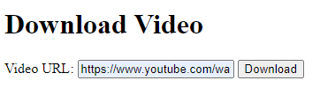

# YouTube Download Simple
A Simple flask app to download youtube videos in mp3 made under 5 minutes.
> 2024 ©, All Rights Reserved. Miguel Gargallo.




## Table of contents

- [YouTube Download Simple](#youtube-download-simple)
  - [Table of contents](#table-of-contents)
  - [Requirements, Installation and Deployment](#requirements-installation-and-deployment)
    - [Python](#python)
    - [yt-dlp](#yt-dlp)
    - [Flask](#flask)
  - [The code](#the-code)
    - [app.py](#apppy)
    - [Index.html](#indexhtml)
  - [Running the app](#running-the-app)
  - [License](#license)


## Requirements, Installation and Deployment

### Python
### yt-dlp
### Flask

1. Install the requirements

- For `yt-dlp` you can use pip to install it.

```bash
pip install yt-dlp
```

- For `flask` you can use pip to install it.

```bash
pip install flask
```

1. Clone the repository

```bash
git clone https://github.com/miguelgargallo/youtube-download-simple
```

1. Run the app

```bash
python app.py
```


## The code
The code is very simple, it uses the `yt_dlp` library to download the video and then sends the file to the user.

### app.py

```python
from flask import Flask, request, render_template, send_file
import yt_dlp as youtube_dl

app = Flask(__name__)

@app.route('/')
def home():
    return render_template('index.html')

@app.route('/download', methods=['POST'])
def download_video():
    video_url = request.form.get('videoURL')
    options = {
        'format': 'best',
        'outtmpl': 'video.%(ext)s',
    }
    with youtube_dl.YoutubeDL(options) as ydl:
        ydl.download([video_url])
    return send_file('video.mp4', as_attachment=True)

if __name__ == '__main__':
    app.run(debug=True)
```

### Index.html

```html
<!DOCTYPE html>
<html lang="en">
<head>
    <meta charset="UTF-8">
    <meta name="viewport" content="width=device-width, initial-scale=1.0">
    <title>Video Downloader</title>
</head>
<body>
    <h1>Download Video</h1>
    <form action="/download" method="post">
        <label for="videoURL">Video URL:</label>
        <input type="text" id="videoURL" name="videoURL" required>
        <button type="submit">Download</button>
    </form>
</body>
</html>
```


## Running the app

To run the app, simply run the `app.py` file.

```bash
python app.py
```

Then go to `http://127.0.0.1:5000` in your browser and you will see the app.


## License

This project is licensed under the [Pylar AI Creative ML Non Commercial License](https://huggingface.co/spaces/superdatas/non-commercial-license).
